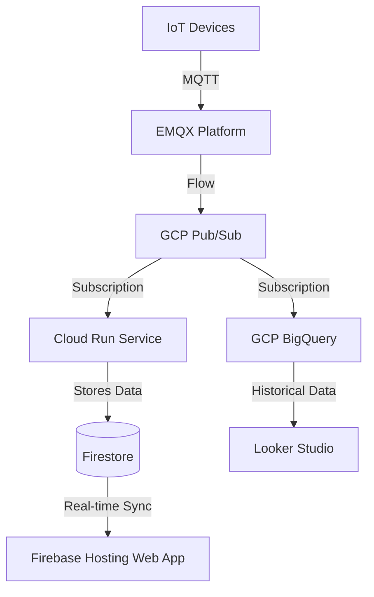
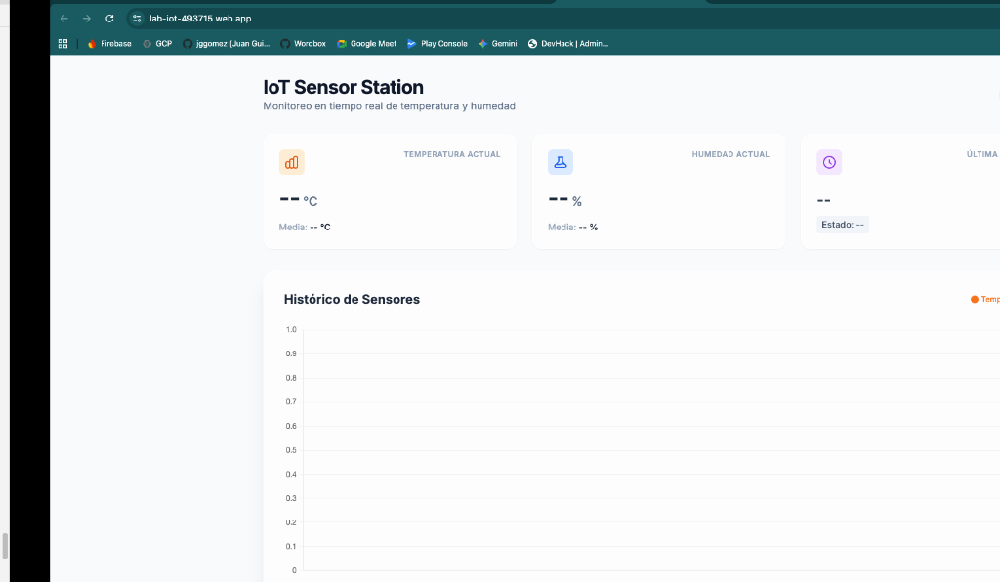

# IoT Sensor Data Pipeline & Dashboard

## Project Description
This project implements a real-time IoT sensor data pipeline and visualization architecture. It connects, processes, and streams real-time data from devices to cloud analytics and dynamic dashboards. Massive IoT data is turned into actionable intelligence by routing messages through a unified MQTT platform to Google Cloud and Firebase services for both real-time monitoring and historical analysis.

## Architecture

The system follows an event-driven architecture, capturing sensor data via MQTT and processing it through scalable cloud services.

### Components Explanation

* **EMQX (The Unified MQTT Platform for Robotics)**: Connects, processes, and streams real-time data from millions of devices to any cloud, AI, and analytics. It turns massive IoT data into actionable intelligence. EMQX acts as the entry point, receiving messages on specific topics and routing the flow to the cloud.
* **GCP Pub/Sub**: A highly scalable messaging service that ingests the data stream from EMQX. It acts as a central hub, decoupling the ingestion layer from the storage and processing layers.
* **Pub/Sub Subscriptions**:
  * **BigQuery Subscription**: Routes raw sensor data directly into BigQuery for long-term storage and complex data analysis.
  * **Cloud Run Subscription**: Routes data to a backend service for real-time processing.
* **Cloud Run**: A serverless compute environment that runs the backend service. It processes the incoming Pub/Sub messages and writes the structured data to the Firestore database.
* **Firestore**: A flexible, scalable NoSQL cloud database. It stores the latest processed sensor readings, enabling real-time synchronization with the frontend application.
* **Firebase Hosting (Web App)**: Hosts the frontend web application. The application reads data in real-time directly from Firestore and provides a live dashboard visualization of the sensors (as seen in the first attached screen).
* **Looker Studio**: A business intelligence tool connected directly to GCP BigQuery. It fetches historical data to visualize long-term trends and metrics across the sensor network (as seen in the secondary attached screens).

## Dashboards

1. **Real-time Web App**: A dynamic, responsive dashboard hosted on Firebase. It provides live updates of current temperature, humidity, and status indicators directly from Firestore.

2. **Looker Studio Analytics**: A comprehensive reporting interface pulling historical and aggregated data from BigQuery to uncover deeper insights.

### Additional Views

---
*Note: The flow architecture image originally provided is referenced here:*

