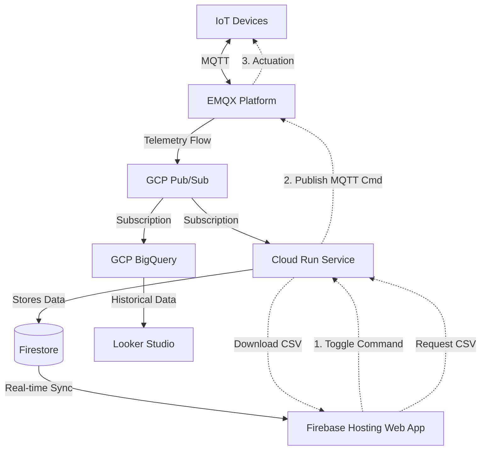

# IoT Sensor Data Pipeline & Dashboard

## Project Description
This project implements a real-time IoT sensor data pipeline and visualization architecture. It connects, processes, and streams real-time data from devices to cloud analytics and dynamic dashboards. Massive IoT data is turned into actionable intelligence by routing messages through a unified MQTT platform to Google Cloud and Firebase services for both real-time monitoring and historical analysis.

## Key Features
* **Real-time Monitoring**: Instant visualization of temperature and humidity via Firestore synchronization.
* **Remote Device Actuation**: Bidirectional communication allowing users to control device power states (ON/OFF) directly from the dashboard.
* **Historical Data Export**: On-demand CSV generation and download from the web dashboard.
* **Direct Sensor Integration**: Real-world data collection using ESP32 and DHT22 sensors.
* **Scalable Analytics**: Deep insights and trend analysis using BigQuery and Looker Studio.

## Architecture

The system follows an event-driven architecture, capturing sensor data via MQTT and processing it through scalable cloud services.

### Components Explanation

* **IoT Layer (ESP32 Nodes)**: Distributed edge devices collecting environmental data. They stream data using lightweight JSON payloads over MQTT. The "edge" of this system is powered by the ESP32, a powerful microcontroller with integrated Wi-Fi. In this project, it acts as a telemetry producer, sampling sensors and pushing structured data to the cloud. The C++ code for the ESP32 is located in the `device-iot/` directory.
  * **Hardware Components**: To replicate the physical setup, the following components are used:
    * **MCU**: ESP32 (NodeMCU or similar).
    * **Environment Sensor**: DHT22 (High-accuracy temperature and humidity).
    * **Actuator**: LED (Status indicator or remote actuation).
    * **Connectivity**: 2.4GHz Wi-Fi.
* **EMQX (The Unified MQTT Platform for Robotics)**: Connects, processes, and streams real-time data from millions of devices to any cloud, AI, and analytics. It turns massive IoT data into actionable intelligence. EMQX acts as the entry point, receiving messages on specific topics and routing the flow to the cloud.
* **GCP Pub/Sub**: A highly scalable messaging service that ingests the data stream from EMQX. It acts as a central hub, decoupling the ingestion layer from the storage and processing layers.
* **Pub/Sub Subscriptions**:
  * **BigQuery Subscription**: Routes raw sensor data directly into BigQuery for long-term storage and complex data analysis.
  * **Cloud Run Subscription**: Routes data to a backend service for real-time processing.
* **Cloud Run**: A serverless compute environment that runs the backend service. It processes incoming Pub/Sub messages to update Firestore and provides a REST API for dynamic CSV data export. It also acts as a command gateway, translating dashboard interactions into MQTT commands.
* **Remote Actuation (Actuador)**: The system supports bidirectional communication. When a user toggles the switch on the dashboard, a command is sent to Cloud Run, which then publishes an MQTT message to the device. The device (ESP32) listens for these commands and adjusts its state (e.g., turning on/off a relay or LED) accordingly.
* **Firestore**: A flexible, scalable NoSQL cloud database. It stores the latest processed sensor readings, enabling real-time synchronization with the frontend application.
* **Firebase Hosting (Web App)**: Hosts the frontend web application. The application reads data in real-time directly from Firestore and provides a live dashboard visualization of the sensors.
* **Looker Studio**: A business intelligence tool connected directly to GCP BigQuery. It fetches historical data to visualize long-term trends and metrics across the sensor network.

---

## EMQX Data Flow

**Flow Explanation:**
1. **Device Connection**: IoT sensors publish telemetry data (such as temperature, humidity, and status) to specific MQTT topics on the EMQX broker.
2. **Rule Engine**: EMQX utilizes its built-in rule engine to filter and format the incoming JSON payloads in real-time.
3. **Data Bridge / Sink**: The processed messages are securely bridged via an outbound webhook/sink directly into the **GCP Pub/Sub** topic, ensuring high throughput and decoupled delivery to Google Cloud.

---

## Dashboards

### 1. Real-time Web App
A dynamic, responsive dashboard hosted on Firebase. It provides live updates of current temperature, humidity, and status indicators directly from Firestore.
**Live URL:** [https://lab-iot-493715.web.app/](https://lab-iot-493715.web.app/)

### 2. Looker Studio Analytics
A comprehensive reporting interface pulling historical and aggregated data from BigQuery to uncover deeper insights.
**Live URL:** [https://datastudio.google.com/reporting/b55cb1b2-f39e-4a64-a833-38380efe0f56](https://datastudio.google.com/reporting/b55cb1b2-f39e-4a64-a833-38380efe0f56)

---

## IoT Layer (ESP32 Nodes) 

--

## Conclusions
* **Scalability**: By leveraging serverless components (Cloud Run, Firestore, Firebase, BigQuery), the system scales automatically from a few devices to millions without manual infrastructure intervention.
* **Real-time vs Historical**: The dual-path architecture ensures ultra-low latency updates for operational dashboards (via Firestore) while independently preserving robust historical datasets for deep business intelligence (via BigQuery).
* **Decoupling**: The usage of EMQX as a dedicated MQTT broker and GCP Pub/Sub as the main messaging hub prevents tight coupling between the devices and the application logic, increasing system fault tolerance.

---

## References
* [EMQX MQTT Platform](https://www.emqx.com/en)
* [Google Cloud Pub/Sub](https://cloud.google.com/pubsub)
* [Google Cloud Run](https://cloud.google.com/run)
* [Firebase Firestore & Hosting](https://firebase.google.com/)
* [Google Cloud BigQuery](https://cloud.google.com/bigquery)
* [Looker Studio](https://lookerstudio.google.com/)
